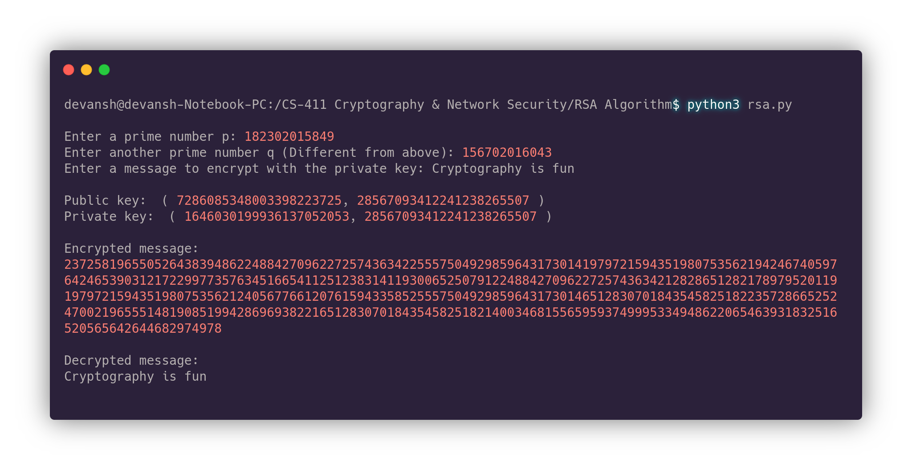

# RSA-Algorithm
An  implementation of RSA encryption algorithm in Python using GMPY2 module

## Step-1: Install GMPY2:

Install GMPY2 using the following commands:

`sudo apt-get install libmpc-dev`

`sudo apt-get install python-pip`

`pip3 install gmpy2`

## Step-2: Run the code

Run the code by either downloading the file or coping the code and follow the on-screen instructions.

The output is shown below:

**PS**: Get very large prime numbers from here: [List of prime numbers up to 1 000 000 000 000 (1000 billion)](http://compoasso.free.fr/primelistweb/page/prime/liste_online_en.php "List of prime numbers up to 1 000 000 000 000 (1000 billion)")
